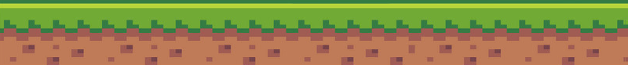

# Codder Runner

## Concept

- Endless runner game where you control a software developer that is running and avoiding obstacles

## Game play

- You will be able to jump or to double jump to avoid the obstacles that will come for you and defeat you.
- The longer you stay alive the higher your score will be

## Elements

- Character: A running software developer with the ability to jump and to double jump
> The character animation consists of two sprites:

- Obstacles: Little platforms with the word `ERROR` on them flying towards the character to push him away
> Sprite:

- Ground: The ground the character is running on
> Image:

- Background: A scrolling background with buildings
> Image:
