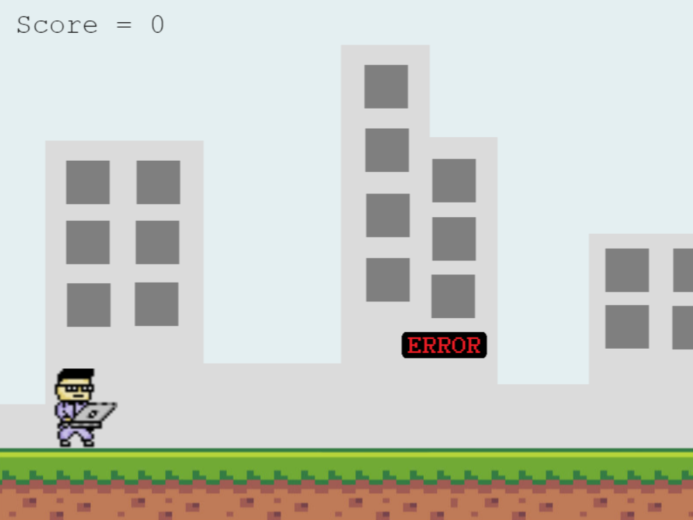

## Coder Runner

> Endless runner game made with phaser JS

- Endless runner game where you control a software developer that is running and avoiding errors
- Press SPACE or LEFT MOUSE keys to jump
- You can press again to double jump
- You can step on errors or touch them but be careful not to be pushed away
## Built With 

- JavaScript, HTML5 and Bootstrap

## Live Demo

[Live Demo Link](https://competent-visvesvaraya-c58dd1.netlify.app/)
### Prerequisites

- Modern Browser (Chrome, Firefox...)
- Node.js
## Getting Started

To get a local copy up and running follow these simple example steps.

- clone the repo into a folder of your choice : `git clone git@github.com:AymenBida/Coder-Runner.git`
- `cd Coder-Runner`
- `npm install`
- `npm run start`

# Author

👤 **Aymen Bida**

- GitHub: [@AymenBida](https://github.com/AymenBida)
- Twitter: [@AymenBida](https://twitter.com/AymenBida)
- LinkedIn: [AymenBida](https://www.linkedin.com/in/aymenbida/)

## 🤝 Contributing

Contributions, issues and feature requests are welcome!

Feel free to check the [issues page](https://github.com/AymenBida/Coder-Runner/issues).

## Acknowledgments

- VectorStock.com for the ground PixelArt
- Microverse for the ReadMe template

## Show your support

Give a ⭐️ if you like this project!

## 📝 License

Copyright 2021 Aymen Bida

Permission is hereby granted, free of charge, to any person obtaining a copy of this software and associated documentation files (the "Software"), to deal in the Software without restriction, including without limitation the rights to use, copy, modify, merge, publish, distribute, sublicense, and/or sell copies of the Software, and to permit persons to whom the Software is furnished to do so, subject to the following conditions:

The above copyright notice and this permission notice shall be included in all copies or substantial portions of the Software.

THE SOFTWARE IS PROVIDED "AS IS", WITHOUT WARRANTY OF ANY KIND, EXPRESS OR IMPLIED, INCLUDING BUT NOT LIMITED TO THE WARRANTIES OF MERCHANTABILITY, FITNESS FOR A PARTICULAR PURPOSE AND NONINFRINGEMENT. IN NO EVENT SHALL THE AUTHORS OR COPYRIGHT HOLDERS BE LIABLE FOR ANY CLAIM, DAMAGES OR OTHER LIABILITY, WHETHER IN AN ACTION OF CONTRACT, TORT OR OTHERWISE, ARISING FROM, OUT OF OR IN CONNECTION WITH THE SOFTWARE OR THE USE OR OTHER DEALINGS IN THE SOFTWARE.
